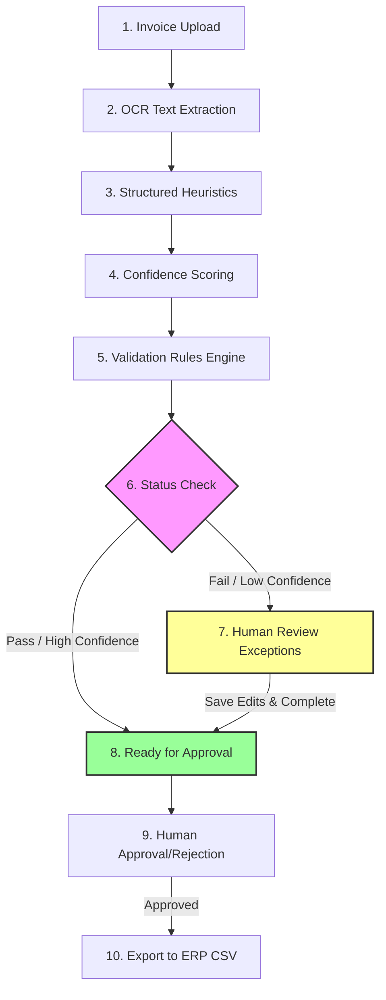

# DocuFlow AI — Enterprise AI Document & Invoice Intelligence Platform

[](https://python.org)
[](https://fastapi.tiangolo.com)
[](https://react.dev)
[](https://typescriptlang.org)
[](https://postgresql.org)
[](https://docker.com)
[](https://jwt.io)
[](https://alembic.sqlalchemy.org)
[](https://opensource.org/licenses/MIT)

DocuFlow AI is an enterprise-style AI document and invoice intelligence platform designed to automate invoice processing workflows. From initial file upload and AI-assisted OCR field extraction to validation rules check, reviewer exceptions handling, manual approvals, and ERP exports, DocuFlow AI implements a modern, auditable human-in-the-loop finance workflow.

---

## The Business Problem

Manual invoice processing is one of the most resource-intensive tasks in corporate finance operations, prone to:
* **Human Errors**: Typographical mistakes in numbers, dates, or line-item totals leading to incorrect payments.
* **Lack of Validation**: Difficulty matching invoice totals to original purchase orders (POs) and verifying vendor registrations.
* **Audit Gaps**: Missing history logs detailing who uploaded, reviewed, corrected, or approved financial transactions.
* **Security & Fraud Risk**: Duplicate invoice numbers or unauthorized vendors passing through internal business gates.

### The AI-Assisted Philosophy
In enterprise environments, autonomous AI agents should not independently approve or execute payments. DocuFlow AI operates on the **Human-in-the-loop** principle:
1. **AI extracts, scores, suggests, and warns** about OCR outputs and validation rule failures.
2. **Reviewers resolve exceptions and correct fields**.
3. **Approvers manually approve, reject, or export** invoices to ERP ledgers.
4. **Every action generates a tamper-evident audit history record**.

---

## Core Process Workflow



---

## Key Features

* **Authentication & RBAC**: JWT access/refresh token exchanges with role guards (`ADMIN`, `PROCESSOR`, `REVIEWER`, `APPROVER`).
* **OCR & Heuristics Pipeline**: Text extraction for digital PDFs via `pypdf`, and simulated fallback with warnings for scanned images.
* **9 Validation Rules**: Automatically checks vendor status, PO matches, remaining balances, duplicate records, positive totals, and future invoice dates.
* **Inline Corrections**: Hover-and-edit fields directly on the detail page to fix OCR mistakes.
* **Complete Review Flow**: Reviewers input notes, validate core fields, and mark review completed.
* **Timeline Auditing**: Records all transitions, corrections, and comments in a read-only audit log.
* **Dashboard Insights**: Live calculations of total spends, exception distributions, and processing metrics.
* **Docker Infrastructure**: Ready-to-go Docker Compose configuration combining PostgreSQL, Redis, FastAPI, and Vite dev host.

---

## Technology Stack

* **Frontend**: TanStack Start, TanStack Router, React, TypeScript, Tailwind CSS, Lucide Icons, Shadcn UI components.
* **Backend**: FastAPI, SQLAlchemy (2.x), Alembic, Pydantic (v2), Uvicorn, PostgreSQL, passlib/bcrypt, python-jose.
* **Infrastructure**: Docker, Docker Compose, PostgreSQL (16), Redis (7).

---

## Repository Structure

```text
docuflow-ai/
├── apps/
│   └── api/                # FastAPI backend codebase
│       ├── app/
│       │   ├── api/        # Routers and endpoints
│       │   ├── core/       # Configurations, security, deps, RBAC
│       │   ├── db/         # SQLAlchemy sessions & init seed scripts
│       │   ├── models/     # Declarative database models (10 tables)
│       │   ├── schemas/    # Pydantic serialization schemas
│       │   └── services/   # Audit, extraction, and validation logic
│       └── alembic/        # Alembic database migrations
├── frontend/               # TanStack Start frontend application
│   ├── src/
│   │   ├── components/     # Reusable UI controls and badges
│   │   ├── hooks/          # Custom React Query query/mutation hooks
│   │   ├── lib/            # Authentication context provider
│   │   ├── routes/         # TanStack Router layouts and pages
│   │   └── services/       # Modular client api/service wrappers
├── infra/                  # Infrastructure configurations (Docker Compose)
└── docs/                   # Full system architecture documentation
```

---

## Quick Onboarding

### 1. Configure Environments
Copy the sample environment file in the root directory:
```bash
cp .env.example .env
```

### 2. Run with Docker Compose
Spin up Vite, FastAPI, PostgreSQL, and Redis containers:
```bash
docker compose -f infra/docker-compose.yml up --build
```
* **Frontend**: [http://localhost:5173](http://localhost:5173)
* **Backend API Docs**: [http://localhost:8000/docs](http://localhost:8000/docs)

### 3. Demo Credentials

| Email / Username | Password | Role | Access Permissions |
| --- | --- | --- | --- |
| `admin@docuflow.ai` | `Admin@123` | **ADMIN** | Unrestricted access, full audit trail, settings |
| `processor@docuflow.ai` | `Processor@123` | **PROCESSOR** | Invoice upload and initial OCR extraction execution |
| `reviewer@docuflow.ai` | `Reviewer@123` | **REVIEWER** | View review queue, inline field corrections, complete review |
| `approver@docuflow.ai` | `Approver@123` | **APPROVER** | View ready approvals, approve/reject/export invoices |

---

## Detailed Documentation

Find exhaustive design guides and scripts under the `/docs` directory:
* **[System Architecture](docs/architecture.md)** — component layouts, lifecycles, and mermaid system flowcharts.
* **[Database Design](docs/database.md)** — schema structures, field descriptions, and ER diagrams.
* **[API Reference](docs/api.md)** — router endpoints payload schemas, responses, and roles requirements.
* **[Security Architecture](docs/security.md)** — RBAC design patterns, JWT lifespan details, and human controls.
* **[Deployment Guide](docs/deployment.md)** — compose structures, seeding configurations, and production hardening checklist.
* **[Workflow Process](docs/workflow.md)** — document states progression and validation mechanics.
* **[Stakeholder Demo Script](docs/demo-script.md)** — consulting-ready 3-minute project walkthrough.
* **[Consulting Case Study](docs/case-study.md)** — business benefits and engineering lessons summary.
* **[Technical FAQ](docs/faq.md)** — core product questions and ERP integrations design answers.

---

## License
Distributed under the MIT License. See `LICENSE` for more information.
