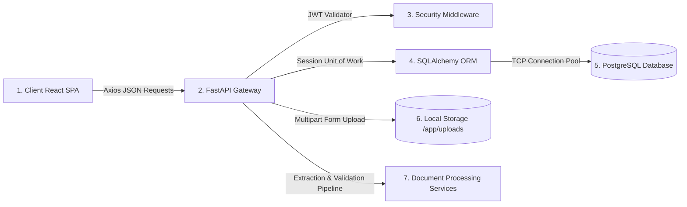
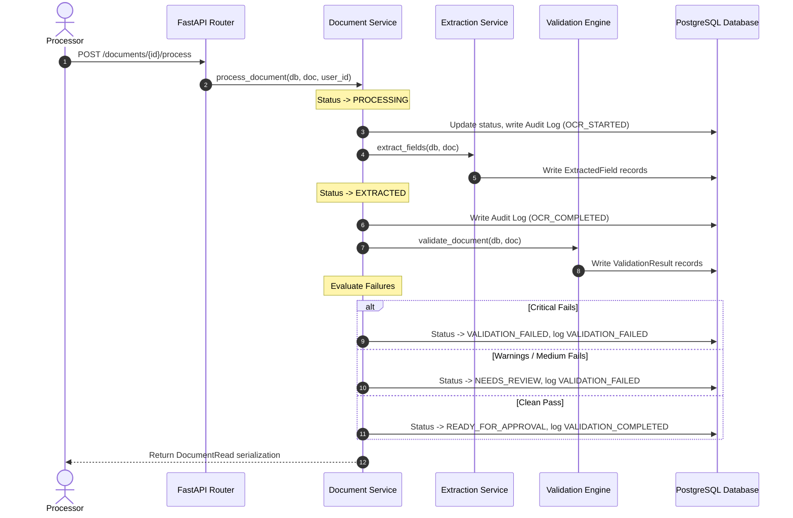

# DocuFlow AI — System Architecture

DocuFlow AI is built using a modern decoupled client-server architecture, separation of concerns, and human-in-the-loop design principles.

---

## High-Level Architecture Flow

---

## Component Responsibilities

### 1. Frontend SPA (TanStack Start & Router)
* **Routing**: Managed via TanStack Router with client-side route guards validating session state.
* **State Management**: Asynchronous server caches are synchronized using custom React Query hooks under `src/hooks`.
* **API Client**: Intercepts outgoing calls to inject JWT Bearer headers and handle token renewals.

### 2. Backend REST API (FastAPI)
* **Request Validation**: Strictly serializes JSON payloads and parameters using Pydantic V2 schemas.
* **Dependency Injection**: Resolves security roles requirements and database context sessions on-the-fly.

### 3. Business Service Layer
* **Extraction Service**: Runs digital PDF extraction via `pypdf` and coordinates image OCR simulation.
* **Validation Engine**: Sequentially checks 9 configurable compliance rules.
* **Audit Logger**: Captures changes, actors, IP addresses, and transition states.

---

## Request Lifecycle (Process Pipeline)

