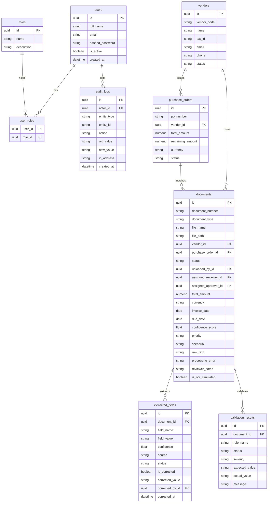

# DocuFlow AI — Database Design

DocuFlow AI implements a relational database structure designed with SQLAlchemy ORM and PostgreSQL. UUIDs are used for all primary keys to guarantee unique identification across potential distributed ledgers.

---

## Entity Relationship Diagram

---

## Major Tables Layout

### 1. `documents`
Stores metadata, file storage references, and active process pipeline statuses.
* `id` (UUID, Primary Key)
* `document_number` (String, Indexed, Unique) - Extracted invoice reference.
* `status` (String) - Mapped enum values (`UPLOADED`, `NEEDS_REVIEW`, etc.).
* `raw_text` (String) - Full OCR output.
* `is_ocr_simulated` (Boolean) - True if image OCR fallback is active.
* `reviewer_notes` (String) - Comments saved during human verification.

### 2. `extracted_fields`
Saves key-value pairs parsed from the document with audit histories.
* `id` (UUID, Primary Key)
* `document_id` (UUID, Foreign Key)
* `field_name` (String) - Field identifier (`Invoice Number`, `Total Amount`, etc.).
* `field_value` (String) - Value originally returned by the extraction pipeline.
* `corrected_value` (String) - Edited value overwritten by the human reviewer.
* `is_corrected` (Boolean) - Flags human intervention.
* `corrected_by_id` (UUID, Foreign Key)
* `corrected_at` (DateTime)

### 3. `validation_results`
Individual rules check outcomes returned by the validation engine.
* `id` (UUID, Primary Key)
* `document_id` (UUID, Foreign Key)
* `rule_name` (String)
* `status` (String) - `PASSED`, `FAILED`, or `WARNING`.
* `severity` (String) - `CRITICAL`, `HIGH`, `MEDIUM`, or `LOW`.
* `expected_value` / `actual_value` (String)

### 4. `audit_logs`
Read-only event log table tracking all application transactions.
* `id` (UUID, Primary Key)
* `actor_id` (UUID, Foreign Key) - Target user.
* `action` (String) - Trigger action (`FIELD_CORRECTED`, `REVIEW_COMPLETED`, etc.).
* `old_value` / `new_value` (String) - Value diff snapshot.
