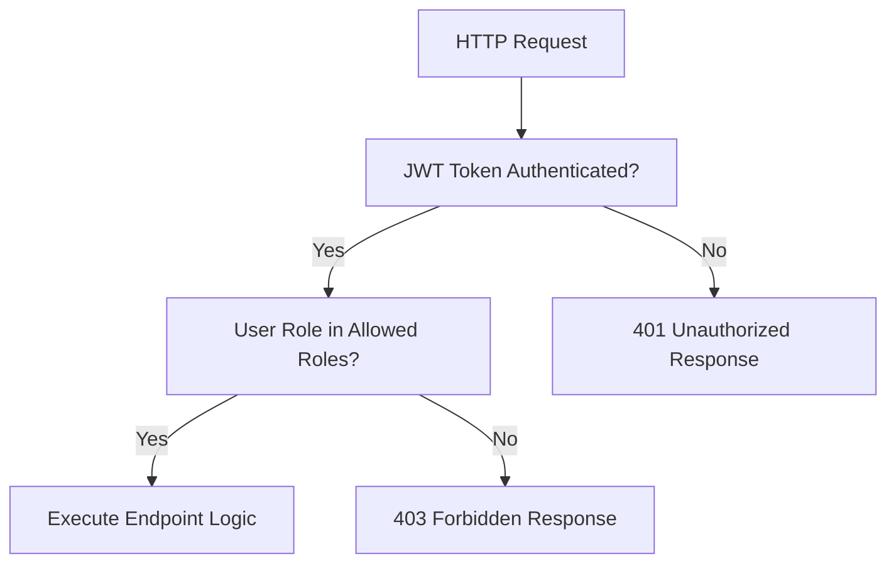

# DocuFlow AI — Security Architecture

DocuFlow AI implements a hardened security system following industry-standard practices for financial transaction processing systems.

---

## 1. JWT Authentication
* Authentication relies on JSON Web Tokens (JWT) signed with a secure, backend-only secret key (`HS256` signature algorithm).
* **Token Expiration**: Access tokens are valid for **30 minutes**. Refresh tokens are valid for **7 days**, requiring secure re-authentication after expiry.
* Passwords are encrypted before database storage using **bcrypt** via the `passlib` context.

---

## 2. Role-Based Access Control (RBAC)
FastAPI path decorators validate user roles directly inside the execution context before executing database changes.

### Roles Permissions Boundaries

* **PROCESSOR**
  - Allowed: Document upload, processing.
  - Prohibited: Field corrections, review approvals, database exports.
* **REVIEWER**
  - Allowed: Viewing exception queues, patching field corrections, running validation checks, completing human reviews.
  - Prohibited: Invoice approvals, invoice rejections, ERP exports.
* **APPROVER**
  - Allowed: Viewing approval queues, approving invoices, rejecting invoices, triggering ERP CSV exports.
  - Prohibited: Programmatic field corrections.
* **ADMIN**
  - Allowed: All operations, audit timeline inspects, system configuration settings.

---

## 3. Human-in-the-Loop Controls
To prevent fraudulent transactions, automated AI components **never** autonomously approve, reject, or export documents:
1. Programmatic validation checks can only raise statuses to `READY_FOR_APPROVAL`.
2. Only an authorized user holding the `APPROVER` or `ADMIN` role can execute an approval or rejection.
3. Every corrective edit and status update is logged with the user's ID, old/new value snapshots, and timestamps.
