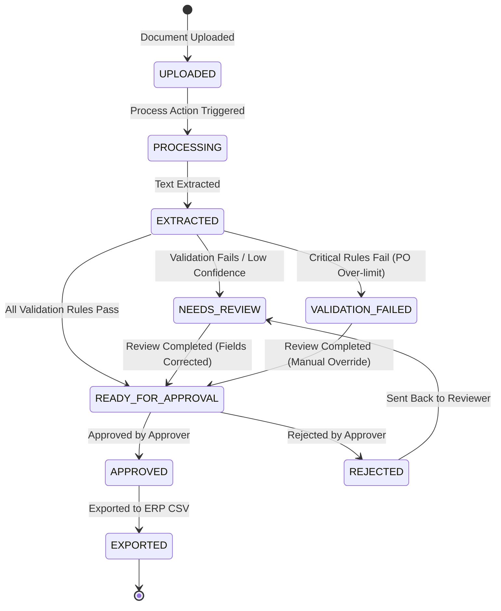

# DocuFlow AI — Workflow & Document States Progression

DocuFlow AI coordinates a deterministic document processing workflow, mapping OCR text extraction output and validation logic results to standardized system statuses.

---

## Document State Transitions

---

## Processing Steps In Detail

### 1. Upload
* A `PROCESSOR` uploads an invoice file (PDF or image).
* A new `Document` record is created in the database with `UPLOADED` status.
* An audit event `DOCUMENT_UPLOADED` is written.

### 2. OCR & Extraction
* The processor triggers extraction. The status changes to `PROCESSING` (`OCR_STARTED` audit logged).
* The service parses text using `pypdf` (or image OCR fallback).
* Raw text is saved on the document, and fields are parsed using regex rules.
* The status becomes `EXTRACTED` (`OCR_COMPLETED` audit logged).

### 3. Rules Validation
* The validation engine evaluates the 9 business compliance checks against vendors and purchase orders.
* **If any CRITICAL rule fails** (e.g. amount exceeds PO limit, duplicate invoice): Status moves to `VALIDATION_FAILED`.
* **If any HIGH/MEDIUM rule fails** (e.g. unknown vendor, low confidence score, missing required field): Status moves to `NEEDS_REVIEW`.
* **If all rules pass**: Status moves to `READY_FOR_APPROVAL`.

### 4. Human Review (Verification)
* A `REVIEWER` inspects documents in the exception queue.
* Reviewers edit fields inline to fix OCR issues (triggering `FIELD_CORRECTED` audit logs).
* Once the errors are fixed, the reviewer submits comments and clicks "Complete Review", shifting the status to `READY_FOR_APPROVAL` (`REVIEW_COMPLETED` audit logged).

### 5. Final Approval & ERP Export
* An `APPROVER` reviews the clean invoice, verifying the audit trail and reviewer notes.
* Approver clicks "Approve" (status becomes `APPROVED`) or "Reject" (status becomes `REJECTED`).
* Once approved, the document can be exported. Exporting extracts details into a CSV schema and updates the status to `EXPORTED`.
* **Autonomous approval is prohibited**: System logic prevents programmatic transitions to `APPROVED` or `EXPORTED` without human authorization credentials.
